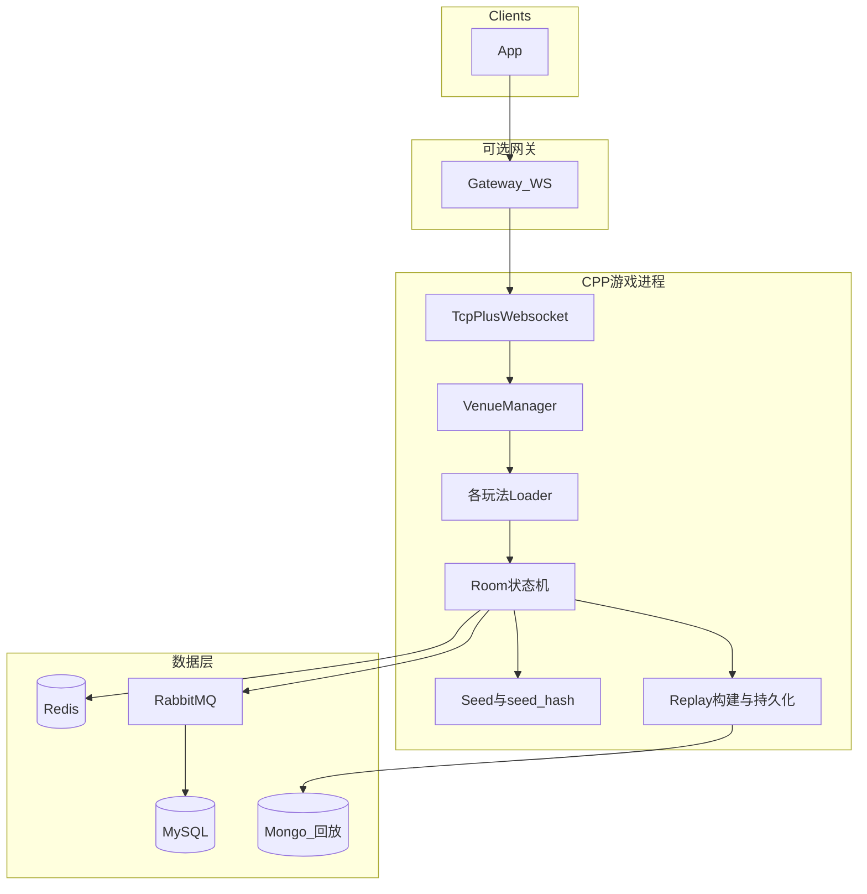

# 游戏 Server 侧开发计划与技术方案（会议稿）

> **版本**：v1.1  
> **依据**：[dev_plan.md](dev_plan.md)、[游戏引擎详细设计.md](游戏引擎详细设计.md)、[数据库详细设计.md](数据库详细设计.md) + 当前 C++ 代码库审视  
> **用途**：与同事评审范围、优先级、风险和接口边界  

---

## 1. 会议目标建议

- 对齐：**平台方案 vs 现存 C++ 单体游戏进程**的职责切分。  
- 确认：**数据库/回放/合规种子**是否与运营、合规、后端（若有独立结算服务）达成一致。  
- 排期：是否采用 **MVP（红中 + 跑得快）**先行，还是从基建（Schema + Mongo）整块开工。  

---

## 2. 文档与「游戏服务端」的对应关系

| 文档 | 对游戏 Server 的指导 |
|------|---------------------|
| `dev_plan.md` | 全平台里程碑、REST/WS 契约、Settlement / Replay / Risk 等**服务边界**；其中「Game Engine Service」需**映射到本进程**或明确由旁路服务承接。 |
| `游戏引擎详细设计.md` | 插件生命周期、Seat / TurnTimer / ActionQueue、回放、解散、断线等**行为规格**与测试矩阵。 |
| `数据库详细设计.md` | `games` / `rooms` / `game_rounds` / `round_actions`、钱包流水、Mongo `game_replays`、Redis Key — **持久化与审计契约**。 |

---

## 3. 代码现状摘要（与文档差异）

| 维度 | 现状 | 与文档差异 |
|------|------|------------|
| 进程形态 | C++ 单体：TCP + WebSocket、MySQL、Redis、RabbitMQ | `dev_plan` 中偏 Go/Java 微服务拆分，需在对外说明中**显式写清实际落地形态**。 |
| 游戏扩展方式 | `VenueLoader` → `Venue/Room`，`VenueInnerHandler`，各玩法独立 Messages | 与文档「插件化」思路一致，但缺**统一门面接口命名**与 **`games.code` 注册表**。 |
| 已实现玩法 | 标准麻将、比鸡、逮狗腿、百人牛牛、掼蛋等 | **非**目标六款地方玩法；需**新增模块**或大改规则层。 |
| 数据库 | Loader 示例仍查 `game_mahjong` 等旧表 | 与「29 张表 + rooms/game_rounds」**不一致**，需迁移或**仓储适配层**。 |
| 回放 / Mongo | 部分玩法有 Playback 轨迹能力；未见 Mongo、`game_rounds.replay_mongo_id` | 与《数据库详细设计》第七节 **未完成**。 |
| 合规种子 | 未见统一 `seed_hash` 入库链路 | 《游戏引擎详细设计》2.1 / `game_rounds.seed_hash` **待补齐**。 |

**关键路径文件（便于在会上打开对齐）**：

- 进程与注册：[`Server/main.cpp`](Server/main.cpp)  
- 加载器契约：[`Framework/Venue/VenueLoader.h`](Framework/Venue/VenueLoader.h)  
- 玩法类型：`Server/GameDefines.h`（当前为整数枚举，未见 `mahjong_hongzhong` 等字符串码）  

---

## 4. 推荐职责边界（游戏进程内做什么）

游戏 Server **专注**：

- 房间内**状态机**、**规则校验**、**操作优先级**、**广播同步**。  
- **本局合规随机**（seed + hash）、本局动作与快照为**回放**提供素材。  
- 通过 RabbitMQ **发事件**（建房、入局、结算申请等），不强绑「必须由本进程直连写钱包」（可与独立 Settlement 协作）。

游戏 Server **尽量不吞掉**的全平台能力（与 `dev_plan` 对齐时可独立服务或由网关收口）：

- 登录注册、JWT 全生命周期（若网关已做鉴权，游戏进程校验 token 即可）。  
- **钱包权威写入**可先由 Settlement 消费者在事务内写 `wallet_ledgers_*`，避免与规则代码耦合过重。  

---

## 5. 文档接口到 C++ 的映射（便于实现分工）

《游戏引擎详细设计》中的 `GamePlugin`，建议在本仓库映射为：

| 文档接口 | C++ 落点 |
|----------|----------|
| `meta` / `createGame` | `VenueLoader::load` + `*Room` 构造；规则来自 `rooms.config_snapshot` / `rule_version`。 |
| `shuffleAndDeal` / `validate` / `apply` | `*Rule` / Dealer / Room 内核，逐步收到 **Engine 门面类**便于单测。 |
| `checkWin` / `settleRound` / `settleRoom` | Room 收尾 + MQ 或直接调用结算模块；遵守**积分守恒**与流水语义。 |
| `buildReplay` / `recoverState` | `ReplayBuilder`；落 Mongo，MySQL `game_rounds.replay_mongo_id` 回填。 |
| `ActionQueue` 优先级 | HU > GANG > PENG > CHI > DISCARD 等；抽到 **ActionScheduler** 单处维护。 |

---

## 6. 分阶段开发计划（游戏 Server）

### 阶段 A：数据与运行时契约（建议优先）

- 按《数据库详细设计》建表或做 **旧表 → 新表** 迁移与 **RoomRepository** 抽象（可双写过渡期）。  
- **每局**生成随机种子，`seed_hash = SHA256(seed)` 写入 `game_rounds`；明文种子加密字段按文档留存。  
- 接入 **MongoDB**，集合 `game_replays`，结构与文档第七章一致；与现有 Playback 管线合并或替换。  
- **Redis**：逐步对齐文档中的 Key 规范（会话、房间状态、分布式锁）；与现有 [`Constant/RedisKeys`](Framework/Constant/) 统一命名策略（会上需定：**一次性改名 vs 渐进**）。  
- **`games.code`** 与 [`GameDefines.h`](Server/GameDefines.h)：**增加字符串编码与 Loader 映射表**。  

### 阶段 B：引擎公共层收口

1. SecureRandomManager（真随机洗牌 + 审计可追溯）  
2. TurnTimer（基于现有 `TimerManager`，支持暂停与超时 AUTO_PLAY）  
3. Action 优先级队列 + 同桌同时响应时的座位序  
4. DisconnectHandler / DissolveVoter（与现有解散逻辑比对后收敛）  
5. ReplayBuilder（与 WS `action_result` 对齐的结构）  
6. ScoreLedgerWriter **接口**：局内只算「应结 delta」，提交由单一出口（避免散落 SQL）  

### 阶段 C：玩法实现顺序（与 dev_plan MVP 对齐）

**建议 MVP**：**红中麻将** + **跑得快**  

| 玩法 | 技术要点 |
|------|----------|
| 红中麻将 | 赖子替代与番型、`TingCalculator`；可参考 `Mahjong/`、`StandardMahjong/` 拆分新模块。 |
| 跑得快 | 牌型层级比较、首张黑桃 3；可复用 `Poker/` 组合与出牌管线。 |

**二期**：长沙麻将（起手胡 + 中鸟）→ 益阳歪胡子（胡息、吃组合枚举）→ 沅江千分（叫分抢庄）→ 桃江麻将（2 人、强配置）。  

每款交付：**Loader + Room + RoomHandler + Messages + Rule + 文档§五测试矩阵**  

### 阶段 D：联调与非功能

- **协议**：向 `dev_plan` §7 的 `{type, seq, payload}` 靠拢；若线上为 MsgPack/二进制，需定义**兼容层**。  
- **观测**：操作延迟 P99、结算耗时、房内并发；日志带 `room_id`、`round_id`、`request_id`。  
- **风控**：仅上报事件/MQ，`risk_events` 旁路写入；**不参与发牌与结果**。  

---

## 7. 风险与待决策项（上会清单）

| 项 | 说明 |
|----|------|
| 表结构切换 | **一刀切迁移** vs **Repository 双语义**：影响工期与上线窗口。 |
| 钱包写入位置 | **进程内直连 MySQL** vs **MQ + Settlement**：影响事务边界与回放失败回滚策略。 |
| 协议兼容 | WS/JSON vs 现有二进制：是否网关转换。 |
| 回放大小 | `state_snapshot` 频率 vs 存储成本；是否二期走 OSS。 |
| `server_dev_plan.md` | 仓库内已有超长版（约千行）；**是否与本文合并为单一真源**，避免双线维护。  

---

## 8. 粗粒度工期参考（仅游戏 Server；人天视人力与迁移难度浮动）

| 阶段 | 内容 | 量级（示意） |
|------|------|--------------|
| A | Schema + Seed + Mongo + Redis 对齐 | ~4–8 周 |
| B | 公共引擎组件收口 | ~4–8 周（可与 A 并行部分） |
| C-MVP | 红中 + 跑得快端到端 | 文档估算法侧各数十人天量级，映射到 C++ 需在会上加系数 |
| C-Rest | 余下四款 + 风控钩子 | 随 `dev_plan` 第三、四阶段 |

---

## 9. 建议会议结论栏（可复制填写）

| 决议项 | 结论 |
|--------|------|
| MVP 玩法是否采纳「红中 + 跑得快」 | |
| 数据库迁移策略 | |
| Settlement / 钱包由谁写入 | |
| Mongo 与回放是否本轮必做 | |
| 是否与 `server_dev_plan.md` 合并维护 | |

---

## 10. 与仓库内其它文档的关系

- 本文：**会议讨论的精简决断版**。  
- [server_dev_plan.md](server_dev_plan.md)：更细的清单与条目，可作为执行层展开；建议在会议后**选一个主文档**避免分歧。  

---

*生成说明：内容由开发方案整理，如需改为对外版本可自行删减路径与内部表名。*
